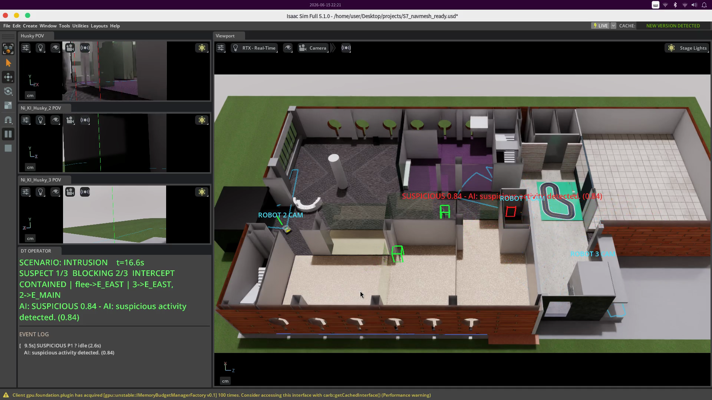

# Robot Patrol — Datacenter Intrusion Defense

> 다중 로봇 협동 순찰·차단 데모
> NVIDIA Isaac Sim 5.1 · MediaPipe Pose · OpenAI GPT-4o-mini Vision



건물에서 Husky 로봇 **3대**가 자율 순찰하다, 침입자가 데이터센터 경계에 잠입하면 가장 가까운 카메라 로봇이 출동·관측하고 AI가 수상 여부를 판정합니다. 침입자가 도주하면 나머지 두 로봇이 출구 2곳을 봉쇄해 검거합니다. 모든 시뮬레이션은 단일 Isaac Sim 창 안에서 동작합니다.

| Normal patrol | Intrusion & interception |
|---|---|
| [`demo_normal_v2.mp4`](demo_normal_v2.mp4) | [`demo_intrusion_v2.mp4`](demo_intrusion_v2.mp4) |

---

## Features

- **다중 로봇 협동** — Husky 3대 (R0 카메라 순찰/추격, R1 정문 차단, R2 동문 차단)
- **신호 융합 판단 엔진** — 6채널 가중합 (`dwell` · `zone` · `behavior` · `time` · `face` · `vlm`)
- **VLM in-the-loop** — GPT-4o-mini Vision API로 장면 단위 위험도 점수화
- **NavMesh 경로 계획** — Omniverse navmesh 기반 자율 보행 / 경로탐색
- **출구 차단 배정** — Greedy ETA 비교로 로봇 ↔ 출구 매칭, 도주 경로 막히면 자동 REROUTE
- **운영자 HUD** — Isaac 창 내부에 이벤트 로그 + 3대 POV 카메라 + FOV 콘 + ID 라벨

---

## Modules

| File | Role |
|---|---|
| `dt_demo.py` | 메인 — Isaac Sim bootstrap, 로봇/사람 시뮬, HUD, VLM 호출, 시나리오 루프 |
| `suspicion.py` | `SuspicionEngine` — 6채널 가중합 판단, level 전이, fire 트리거 |
| `interception.py` | `plan_interception()` — 로봇·출구 greedy 매칭, suspect ETA 예측, REROUTE 감지 |
| `perception.py` | `PersonPerception` — MediaPipe Pose 1인 탐지, bbox·visibility·occlusion 신호 |
| `zones.json` | 구역(datacenter_core / perimeter / office / public)·출구(E_MAIN, E_EAST) 메타 |
| `S7_navmesh_ready.usd` | 건물 + navmesh (63 MB) |
| `Biped_Setup.usd` | AnimationGraph 보행 캐릭터 (49 MB) |
| `record_demo.sh` | ffmpeg 화면 녹화 헬퍼 |

> `Walking.usd`(정적 메시 폴백)는 기본 실행에 불필요 — 부재 시 코드가 자동 스킵.

---

## Environment

- **NVIDIA Isaac Sim 5.1.0** (빌드 `5.1.0-rc.19+release.26219.9c81211b`)
- **플랫폼:** Linux aarch64 (ARM64) — DGX Spark / GB10 권장
- **실행 방식:** standalone SimulationApp (`<isaac>/python.sh dt_demo.py`)

사용 Extension은 모두 Isaac Sim 5.1.0에 기본 내장 (별도 설치 불필요):
`omni.anim.people` / `omni.anim.graph.core` / `omni.anim.navigation.core` /
`omni.replicator.core` / `omni.ui(.scene)` / `omni.kit.viewport.utility` /
`omni.kit.window.script_editor` / `omni.physx` / `isaacsim.core.api` /
`isaacsim.sensors.camera` / `isaacsim.util.debug_draw`

---

## Setup

Isaac Sim 내장 Python에 추가 모듈을 설치합니다.

```bash
ISAAC=/home/user/Desktop/isaacsim          # python.sh 가 있는 폴더로 수정

# 온라인
$ISAAC/python.sh -m pip install -r requirements.txt

# 오프라인 (deps/ 폴더에 wheel 동봉 시)
$ISAAC/python.sh -m pip install --no-index --find-links deps -r requirements.txt
```

**requirements.txt**
```
numpy==1.26.0                  # 반드시 1.26 (타 버전 시 호환 문제)
opencv-python-headless==4.11.0.86
mediapipe==0.10.18
```

> ⚠️ mediapipe / opencv wheel은 **aarch64 (ARM64) / py3.11** 전용 — 채점 PC도 ARM64 필요.

**(선택) OpenAI API 키** — 실제 GPT-4o-mini 판정을 쓰려면 프로젝트 루트에 `.openai_key` 파일을 둡니다(키 한 줄). 없으면 규칙기반 mock으로 동작하며 데모는 정상 진행됩니다. 부팅 로그의 `>>> VLM: OpenAI connected (gpt-4o-mini)` 로 인식 여부 확인.

---

## Run

```bash
DEMO_HEADLESS=0 /home/user/Desktop/isaacsim/python.sh dt_demo.py
```

부팅(navmesh 베이크 + Husky 3대 + 카메라 3대)에 **약 1.5–2분** 소요. 완료 후 단일 Isaac Sim 창에:
- **좌측** — 로봇 POV 3개 + **DT OPERATOR** HUD(이벤트 로그·AI 판정)
- **중앙** — 3D 씬: 구역 바닥(🟥 core / 🟧 perimeter / 🟦 office), 출구 기둥, FOV 콘, ID 라벨
- **우측** — Script Editor (시나리오 트리거 입력)
- **사람 박스 색**: 🟢 정상 → 🟡 평가중 → 🔴 수상 확정

### Scenario 흐름
1. **NORMAL** — 정상인 3명이 각자 경로 보행 (초록)
2. **INTRUSION** — 침입자가 데이터센터 앞으로 잠입, 경계에서 두리번(casing)
3. 최근접 카메라 로봇(R0) 출동·관측 → 노랑(assessing) ~4초 → **AI 판정 빨강(SUSPICIOUS)**
4. 침입자 도주 → 출구가 막혔으면 **반대 출구로 재도주(REROUTE)**
5. R1·R2가 두 출구(E_MAIN / E_EAST) 봉쇄, R0 추격 → 검거(**CORNERED**)
6. 이벤트는 `events.db`(SQLite)와 `evidence/*.png` 스냅샷으로 기록

### Manual trigger
```python
# Isaac 우측 Script Editor
dt_scenario("intrusion")   # 침입 시나리오 시작
dt_scenario("normal")      # 정상 복귀
```
```bash
# 또는 터미널
echo intrusion > /tmp/dt_cmd
```

---

## Suspicion Engine

`SuspicionEngine`은 6개 신호의 가중합으로 0–1 점수를 계산합니다.

| Signal | Weight | Source |
|---|---:|---|
| `dwell` (연속 포착 시간) | 0.52 | perception |
| `zone` (구역 위험도) | 0.22 | zones.json |
| `behavior` (행동 패턴) | 0.16 | dt_demo (idle/pace/wander/loop/run) |
| `time` (after-hours) | 0.08 | zones.json `demo_clock` |
| `face` (얼굴 가림) | 0.06 | perception (visibility < 0.25) |
| `vlm` (GPT-4o-mini) | 0.00\* | OpenAI API |

\* VLM은 엔진 가중치 0이지만 `dt_demo.py`에서 별도 게이팅(`VLM_SUSPECT=0.5`)으로 판정에 직접 반영됩니다.

**Level 전이:** `normal → watch (seen_time ≥ 1.0s 또는 score ≥ 0.35) → suspicious (seen_time ≥ 2.5s 또는 score ≥ 0.78 또는 hard context)`
**Hard context** (즉시 suspicious): restricted 구역 내부, 또는 sensitive_perimeter에서 zone별 loitering 임계 초과.

---

## More

- [`HOW_TO_RUN.md`](HOW_TO_RUN.md) — 자세한 실행 매뉴얼 (환경변수 / zip 이관 / 녹화)
